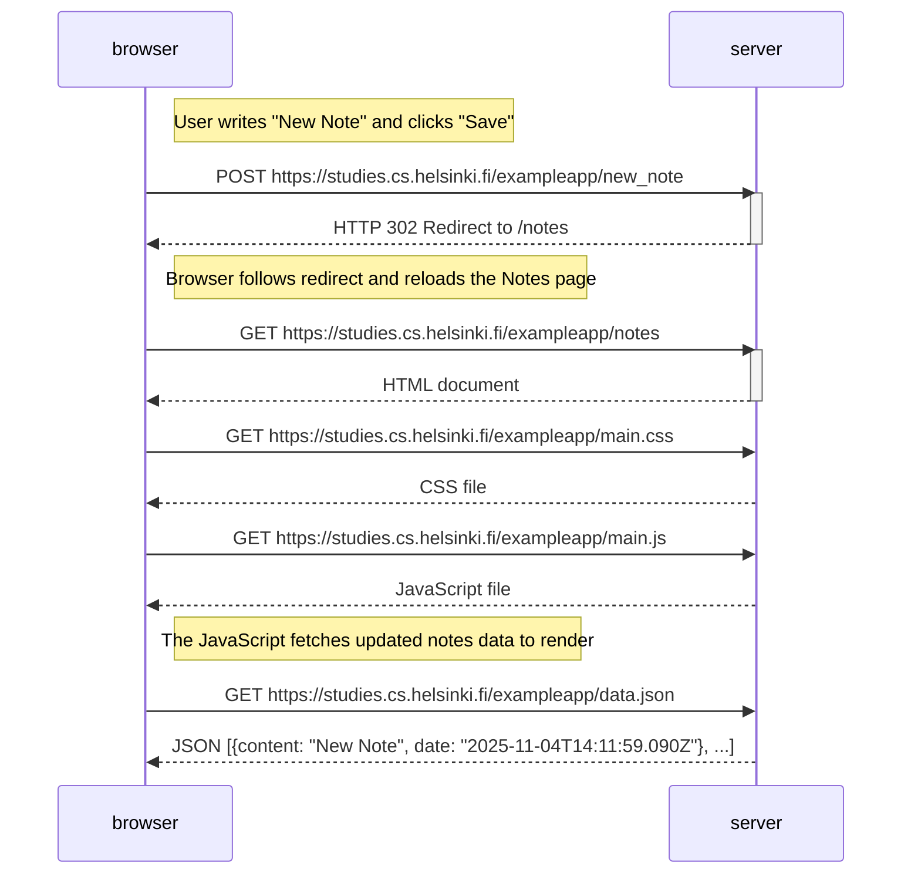

```mermaid
sequenceDiagram
    participant browser
    participant server

    Note right of browser: User writes "New Note" and clicks "Save"

    browser->>server: POST https://studies.cs.helsinki.fi/exampleapp/new_note
    activate server
    server-->>browser: HTTP 302 Redirect to /notes
    deactivate server

    Note right of browser: Browser follows redirect and reloads the Notes page

    browser->>server: GET https://studies.cs.helsinki.fi/exampleapp/notes
    activate server
    server-->>browser: HTML document
    deactivate server

    browser->>server: GET https://studies.cs.helsinki.fi/exampleapp/main.css
    server-->>browser: CSS file

    browser->>server: GET https://studies.cs.helsinki.fi/exampleapp/main.js
    server-->>browser: JavaScript file

    Note right of browser: The JavaScript fetches updated notes data to render

    browser->>server: GET https://studies.cs.helsinki.fi/exampleapp/data.json
    server-->>browser: JSON [{content: "New Note", date: "2025-11-04T14:11:59.090Z"}, ...]

```
